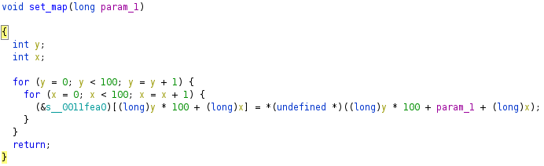

# Rev - wizardlike

Wizardlike - 500 points

Do you seek your destiny in these deplorable dungeons? If so, you may want to look elsewhere. Many have gone before you and honestly, they've cleared out the place of all monsters, ne'erdowells, bandits and every other sort of evil foe. The dungeons themselves have seen better days too. There's a lot of missing floors and key passages blocked off. You'd have to be a real wizard to make any progress in this sorry excuse for a dungeon! Download the [game](https://artifacts.picoctf.net/c/150/game). '`w`', '`a`', '`s`', '`d`' moves your character and '`Q`' quits. You'll need to improvise some wizardly abilities to find the flag in this dungeon crawl. '`.`' is floor, '`#`' are walls, '`<`' are stairs up to previous level, and '`>`' are stairs down to next level.

Hints:

- Different tools are better at different things. Ghidra is awesome at static analysis, but radare2 is amazing at debugging.
- With the right focus and preparation, you can teleport to anywhere on the map.

First thing, I open up the binary in Ghidra. The binary is stripped, but we can go to the `entry` function and double click on the first argument to `__libc_start_main` to get to the main function:


The main function seems to mention some external functions like `initscr`, `noecho`, `curs_set`, etc:


From `ldd` we can see that these symbols come from the `ncurses` library, a library for creating terminal user interfaces:

```
❯ ldd ./game
        linux-vdso.so.1 (0x00007ffce2588000)
        libncurses.so.6 => not found
        libtinfo.so.6 => not found
        libc.so.6 => /nix/store/4s21k8k7p1mfik0b33r2spq5hq7774k1-glibc-2.33-108/lib/libc.so.6 (0x00007fb6ab8f7000)
        /lib64/ld-linux-x86-64.so.2 => /nix/store/4s21k8k7p1mfik0b33r2spq5hq7774k1-glibc-2.33-108/lib64/ld-linux-x86-64.so.2 (0x00007fb6abaf4000)
```

By running the binary, we see that as we move around, more of the board is revealed.
If we run `strings` on the binary, we can see the layout of the levels:

```
❯ strings game | tail -n +29 | head -n 1
.....................................................................................................#................................................................................................#..............
.....................................................................................................................................................................................................................
............................................#........................................................................................................................................................................
.....................................................................................................................................................................................................................
.....................................................................................................................................................................................................................
.....................................................................................................................................................................................................................
.....................................................................................................................................................................................................................
.....................................................................................................................................................................................................................
.....................................................................................................................................................................................................................
.....................................................................................................................................................................................................................
(goes on for much longer)
```

This string seems to match the strings we see in the main function in ghidra.
The strings all get passed into the same function, so let's look at that function.



Taking a guess, it seems like it iterates over the map, splitting into a row every 100 characters.
Effectively, this function just does a `memcpy` into a global variable, but it still gives us an idea of the structure of the map strings.

With this knowledge in hand, I began writing a script to render these map strings.

In ghidra, each call to this function looks something like this:

```c
set_map((long)s_#########_#.......#_......#....._00107740);
```

Using pwntools, I can read out the string using the hex offset at the very end. With a little trail and error, I realized I have to remove the leading 1 from the offset, and it worked:

```python
e = ELF("./game", checksec=False)
print(e.string(0x07740))
```

I made a script to break these strings into rows of 100 and print them, stopping once it reached a blank line:

```py
from pwn import *

e = ELF("./game", checksec=False)

def parse_map(m):
    return [m[i:i + 100] for i in range(0, len(m), 100)]

def read_map(offset):
    return e.string(offset).decode()

def filter_map(m):
    for i, l in reversed(list(enumerate(m))):
        if not all(c == " " for c in l):
            break
    else:
        return m
    return m[:i]

def print_map(level, offset):
    print(f"Level {level}")
    print("\n".join(filter_map(parse_map(read_map(offset)))))

print_map(1, 0x07740)
print_map(2, 0x09e60)
print_map(3, 0x0c580)
print_map(4, 0x0eca0)
print_map(5, 0x113c0)
print_map(6, 0x13ae0)
print_map(7, 0x16200)
print_map(8, 0x18920)
print_map(9, 0x1b040)
print_map(10, 0x1d760)
```

Running this script, we can see the characters of the flag hidden in inaccessible parts of the map.
From other people after the CTF, I learned that you can achieve the same result by running strings and then resizing your terminal to be 100 columns wide.
Truly a genius strat, obviously the intended solution of a 500 point reversing challenge.

While this writeup may seem a little straightforward, this challenge actually took me a really long time.
The hint regarding teleporting really threw me off, and I spent a really long time doing dynamic analysis in `r2`.
I figured out how to teleport around the map and skip to the next level, but after that I had no idea where to teleport to, as after the 10th level I had no idea what to do next.
When I finally decided to dig deeper into how the rendering worked, I ended up finding the flag.

Overall, I think this challenge would have been EASIER without the hint about teleporting as it sent me down a rabbit hole and wasted a ton of my time.
I thought it was pretty fun anyways, and I learned a lot about using r2 both for static and dynamic analysis, as I have never done that before.
I think I still prefer ghidra + r2, but all I had at the time was my high-school issued chromebook and have nothing but the webshell, lol.
